# Lar Boa Viagem

> Sistema web para gestão de uma Instituição de Longa Permanência para Idosos (ILPI), desenvolvido em **Flask (Python)** para cadastro e gerenciamento de hóspedes, controle de usuários e organização de quartos.

---

##  Visão Geral

O **Lar Boa Viagem** é um projeto **acadêmico** e de **portfólio** que centraliza as operações administrativas de um lar de idosos, oferecendo uma interface simples, funcional e organizada para diferentes níveis de acesso (**ADM, Gestor e Cuidador**).

### Objetivos principais

* Facilitar as rotinas administrativas da ILPI
* Centralizar informações de hóspedes, quartos e usuários
* Oferecer controle de acesso baseado em cargos
* Possibilitar o empacotamento do sistema em um executável (.exe)

---

##  Tecnologias

* Python
* Flask
* Jinja2
* MySQL / SQLite (opcional)
* HTML5 / CSS3 / JavaScript
* PyInstaller (geração do executável `.exe`)

---

##  Perfis de Usuário

* **Administrador (ADM)**

  * Controle total do sistema
  * Gerenciamento de usuários e permissões

* **Gestor**

  * Gerenciamento de hóspedes
  * Organização de quartos e setores

* **Cuidador**

  * Visualização das informações permitidas pelo sistema

---

##  Funcionalidades Principais

* Autenticação por cargo
* Controle de sessão de usuários
* CRUD de hóspedes
* Cadastro e organização de quartos e setores
* Templates dinâmicos com Jinja2
* Versão empacotada em executável para Windows (.exe)

---

##  Estrutura do Projeto

```bash
├── Database/        # Modelos e conexão com o banco de dados
├── routes/          # Rotas organizadas por módulo (adm, gestor, cuidador)
├── static/          # CSS, imagens e arquivos JS
├── templates/       # Templates HTML (Jinja2)
├── main.py          # Entrada da aplicação
├── configuration.py # Configurações (DB, secret key, etc.)
├── utils.py         # Funções utilitárias (ex.: validações)
├── utils_db.py      # Funções auxiliares de banco de dados
├── icon.ico
├── README.md
└── .gitignore
```

---

##  Telas do Sistema

### Tela de Login

Tela inicial onde o usuário realiza o login e seleciona seu perfil (ADM, Gestor ou Cuidador), cada um com permissões específicas.

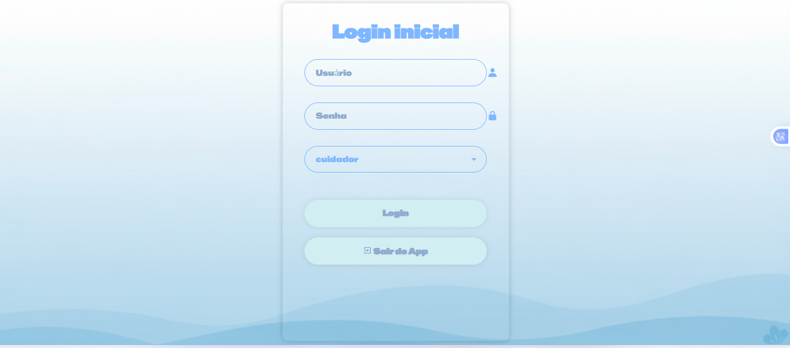

---

### Tela Inicial do Administrador

Painel principal do sistema, com acesso a todas as funcionalidades administrativas.

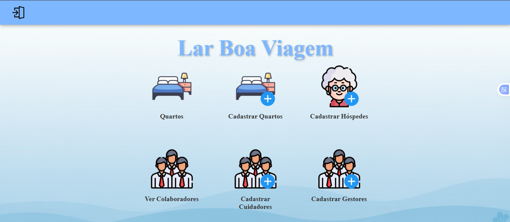

---

### Cadastro de Quartos

Cadastro de quartos disponíveis. O cadastro de hóspedes depende da existência de um quarto válido.

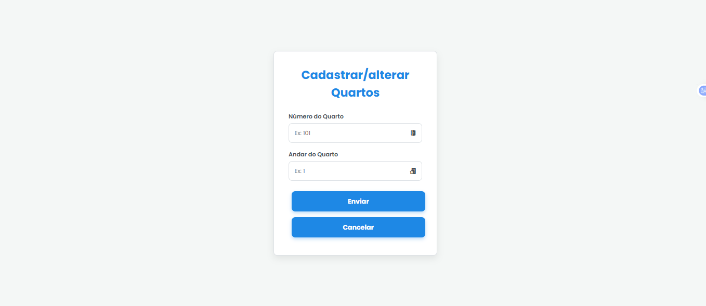

---

### Cadastro de Hóspedes

Tela para registrar novos hóspedes no sistema.

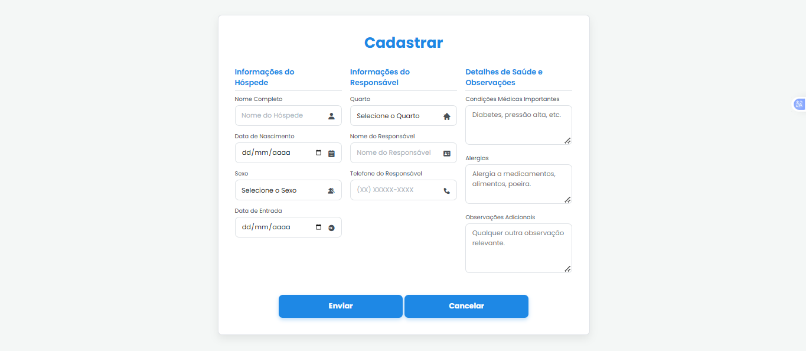

---

### Cadastro de Gestores

Tela exclusiva para cadastro de usuários do tipo Gestor.

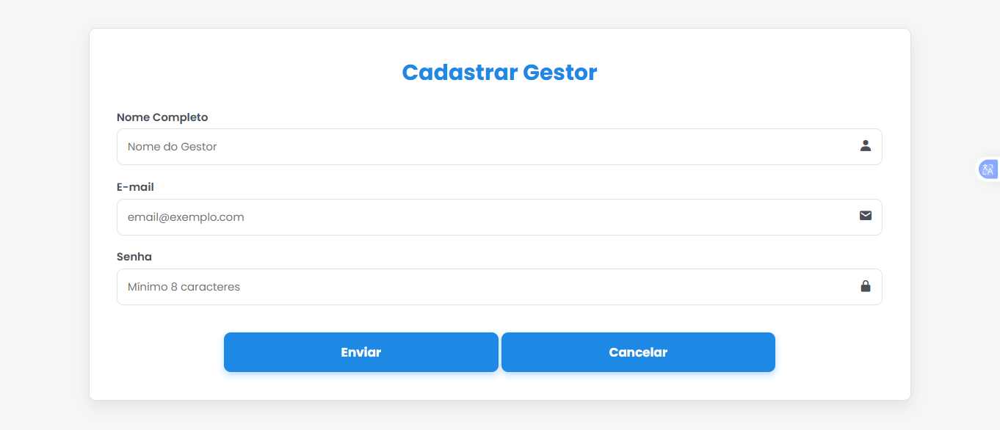

---

### Cadastro de Cuidados

Registro de cuidados e atividades relacionadas aos hóspedes.

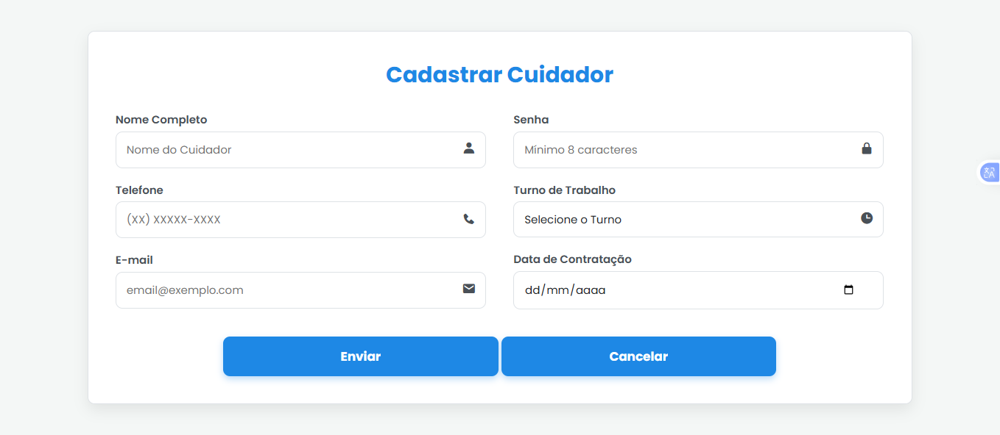

---

### Edição de Hóspede

Permite atualizar os dados de um hóspede já cadastrado.

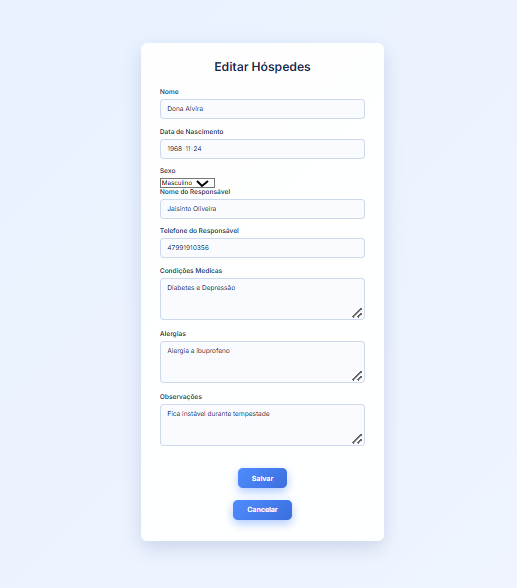

---

### Edição de Colaborador

Atualização de informações de colaboradores do sistema.

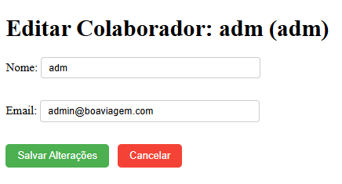

---

### Atualizado por

Indica o usuário responsável pela última alteração de registros.

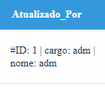

---

### Escolher Quarto

Tela para seleção de um quarto específico.

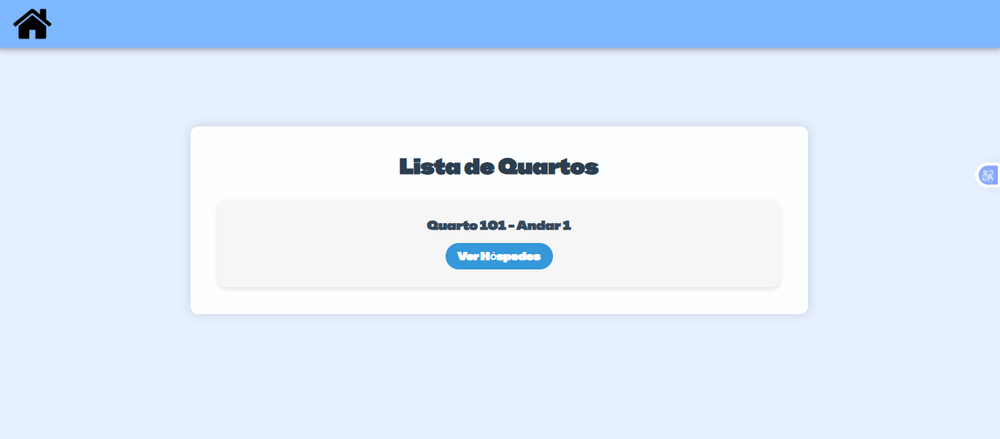

---

### Hóspedes por Quarto

Exibe os hóspedes alocados no quarto selecionado.

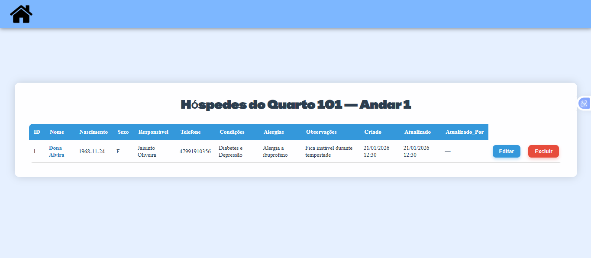

---

### Visualizar Colaboradores

Lista de colaboradores cadastrados no sistema. Acesso exclusivo do administrador.

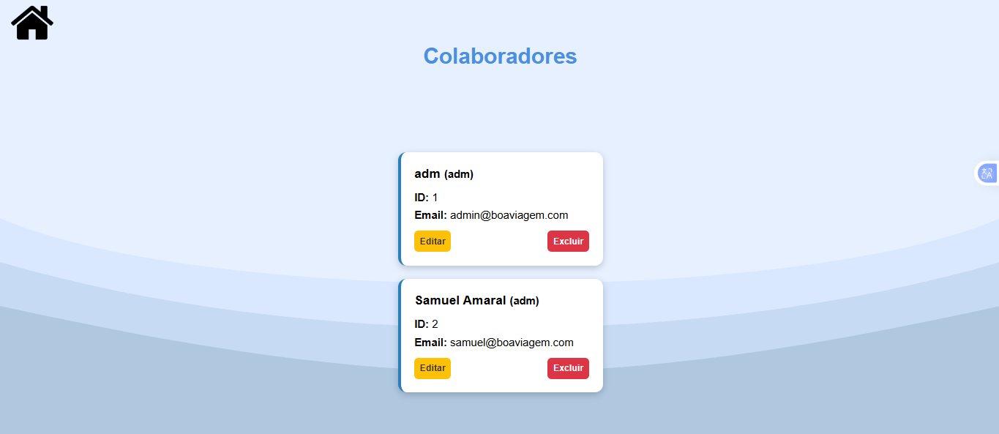

---

##  Instalação (Desenvolvimento)

>  **Importante:** ao utilizar a versão executável (.exe), finalize o sistema sempre pelo botão **Sair** na tela de login. Caso contrário, o processo pode continuar rodando em segundo plano no sistema operacional.

### 1️ Clonar o repositório

```bash
git clone <URL_DO_REPOSITORIO>
cd boa-viagem-lar-idosos
```

---

### 2️ Criar e ativar o ambiente virtual

**Windows**:

```powershell
python -m venv venv
venv\Scripts\activate
```

**Linux / macOS**:

```bash
python3 -m venv venv
source venv/bin/activate
```

Para desativar:

```bash
deactivate
```

---

### 3️⃣ Instalar dependências

```bash
pip install Flask peewee PyInstaller
```

---

### 4️Executar a aplicação

```bash
python main.py
```

Acesse no navegador:

```
http://127.0.0.1:5000
```

---

##  Versão Executável

A versão executável do sistema (Windows) está disponível no link abaixo:

 [https://github.com/samuelgk-commits/boa-viagem-lar-idosos/releases/tag/v1.0](https://github.com/samuelgk-commits/boa-viagem-lar-idosos/releases/tag/v1.0)

---

##  Empacotar com PyInstaller

```bash
pyinstaller --onefile --add-data "templates;templates" --add-data "static;static" --icon=icon.ico main.py
```

**Observações:**

* Ajuste `--add-data` conforme o sistema operacional (`;` no Windows, `:` no Linux/macOS)
* Teste o executável em uma máquina limpa
* Para uso com MySQL ou outros bancos, garanta que as tabelas estejam alinhadas aos models em `Database/`

---

##  Solução de Problemas Comuns

* **Ambiente virtual desativado**: ative novamente ao abrir o projeto. Configure o interpretador no editor (ex.: VS Code).
* **Alterações em templates não aparecem**: limpe o cache do navegador (Ctrl+F5) e utilize o modo `debug` durante o desenvolvimento.
* **Executável interfere no Flask**: certifique-se de encerrar o `.exe` corretamente; processos ativos podem aparecer no Gerenciador de Tarefas.
* **Erro de conexão com banco de dados**: verifique credenciais, serviço ativo e configuração em `configuration.py`.

---

##  Licença

Este projeto está licenciado sob a licença **MIT**. Consulte o arquivo `LICENSE` para mais informações.

---

##  Contato

Em caso de dúvidas ou sugestões, você pode entrar em contato para suporte e ajustes do projeto.

---

**Lar Boa Viagem** — Sistema de Gerenciamento para Instituições de Longa Permanência para Idosos
